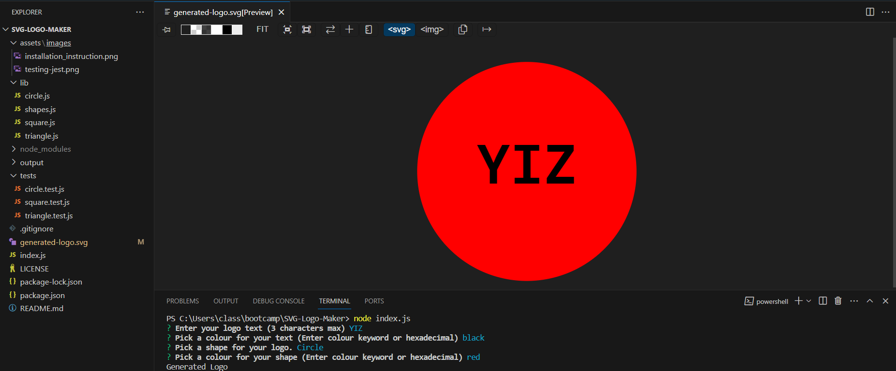
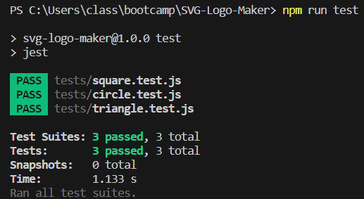
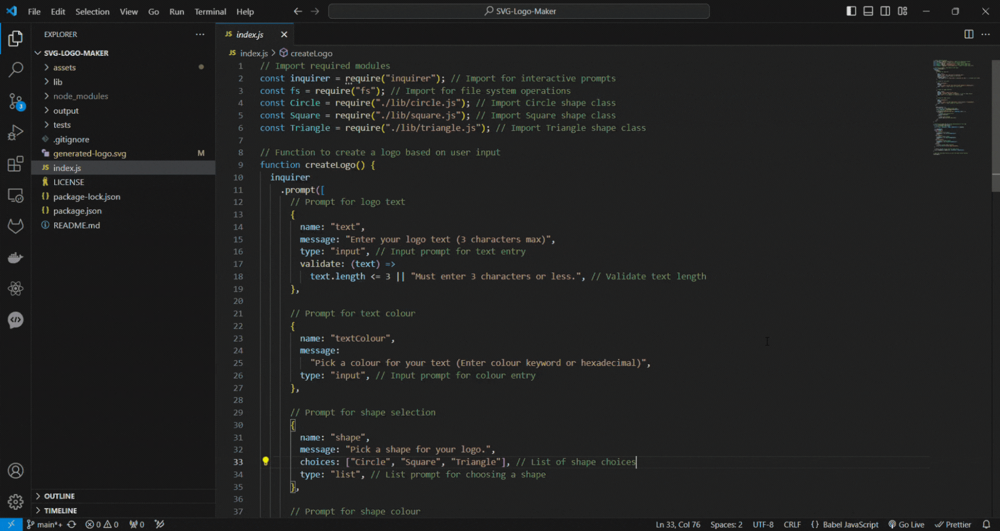

   

<h1 align = "center"> SVG Logo Maker </h1>
This project aims to develop a command-line application specifically designed for freelance web developers. The application's primary function is to generate basic logos for their projects, eliminating the need for paid graphic design services. Through a series of prompts, users will be able to input their desired text, colour preferences, and shape choices. Based on this input, the application will create a corresponding SVG logo file named "generated-logo.svg". This logo will be visually represented as a 300x200 pixel image that adheres to the user's specified criteria. Ultimately, this project seeks to offer a cost-effective solution for freelance web developers to create simple, yet personalised logos for their projects.

## Table of Contents
- [User Story](#user-story)
- [Objectives](#objectives)
- [Technologies Used](#technologies-used)
- [Test Instruction](#test-instruction)
- [Screenshot](#screenshot)
- [Video](#video)
- [Output](#output)
- [Installation](#installation)
- [License](#license)

## User Story
```
AS a freelance web developer
I WANT to generate a simple logo for my projects
SO THAT I don't have to pay a graphic designer
```

## Acceptance Criteria
```
GIVEN a command-line application that accepts user input
WHEN I am prompted for text
THEN I can enter up to three characters
WHEN I am prompted for the text color
THEN I can enter a color keyword (OR a hexadecimal number)
WHEN I am prompted for a shape
THEN I am presented with a list of shapes to choose from: circle, triangle, and square
WHEN I am prompted for the shape's color
THEN I can enter a color keyword (OR a hexadecimal number)
WHEN I have entered input for all the prompts
THEN an SVG file is created named `logo.svg`
AND the output text "Generated logo.svg" is printed in the command line
WHEN I open the `logo.svg` file in a browser
THEN I am shown a 300x200 pixel image that matches the criteria I entered
```

## Technologies Used
- JavaScript
- Node.js
- Inquirer (version 8.2.4)
- Jest (version 29.7.0)

## Test Instruction
  #### Command to install node:
  `
  npm install
  `
  
  #### Command to install Inquirer dependencies:
  `
  npm i inquirer@8.2.4
  `

  #### Command to install Jest dependencies:
  `
  npm i jest
  `

  #### Command to Generate Logos:
  `
  node index.js
  `

  #### Command to Test Framework:
  `
  npm test run
  `

## Screenshot
Generating Logo using Inquirer:



Testing Framework using Jest:



## Video
A walk through video is [here](https://www.youtube.com/watch?v=4rrexRqA8f0).

Generating Logo using Inquirer:


Testing Framework using Jest:



## Output
Running the Command:
- Open your terminal.
- Navigate to the directory where you saved your logo generator code.
- Run the application: "node index.js".

Entering User Input:
- Follow the prompts that appear in the terminal.
- Enter your desired logo text (max 3 characters).
- Select a colour for the text by entering a colour keyword (e.g. "red") or a hexadecimal code (e.g. "#ff0000").
- Choose a shape for your logo from the presented options (circle, triangle, square).
- Provide a colour for the chosen shape using the same format as before.

Result:
- Once you've entered all the information, the application will create a file named generated-logo.svg in the same directory.
- The terminal will display the message "Generated Logo.svg".

Verification:
- Open the generated-logo.svg file in your web browser.
- You should see a 300x200 pixel image depicting your logo based on your chosen text, text colour, shape, and shape colour.

Customisation:
- Feel free to experiment with different combinations of text, colours, and shapes to create unique logos for your projects.

## Installation
The project was uploaded to [GitHub](https://github.com/) at the following repository:
[https://github.com/yukitoshi12345/SVG-Logo-Maker/](https://github.com/yukitoshi12345/SVG-Logo-Maker)

## License
This project is licensed under the [MIT License](https://github.com/Yukitoshi12345/SVG-Logo-Maker/blob/main/LICENSE).